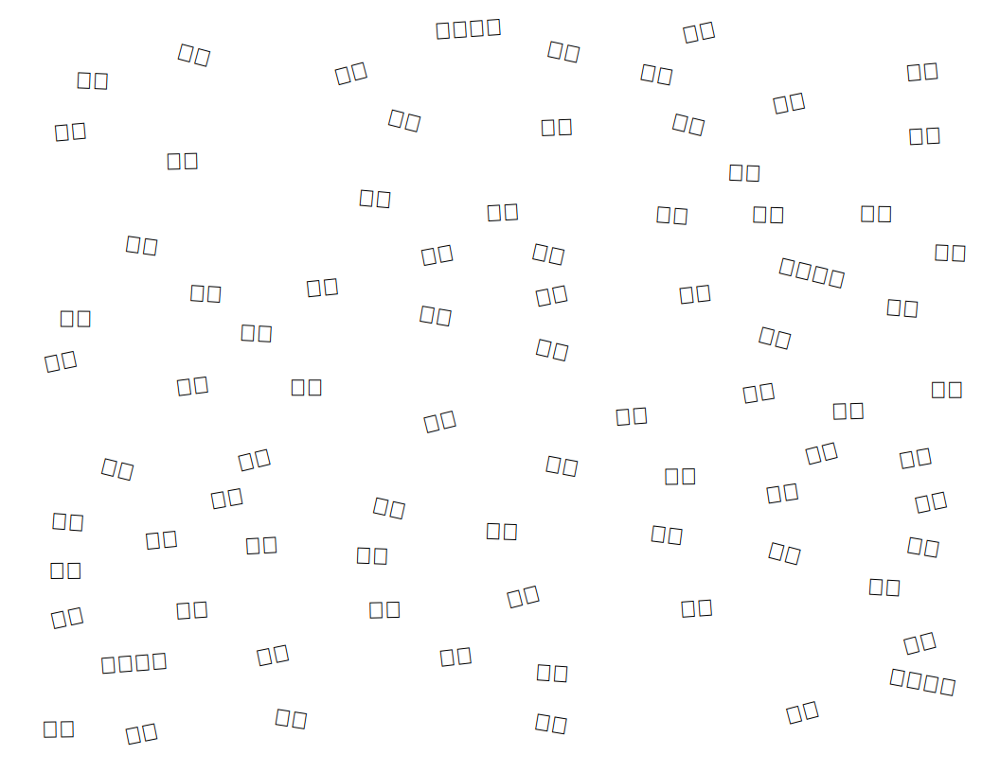

# Emoji Reading Practice Generator

A Node.js program that generates printable SVG files with randomly placed emoji pairs for toddler reading practice (like I-Spy).

Inspired by the [Dogfish test](https://www.mentava.com/ready-to-read).

## How to

Place words in words.txt. Then `node generate.ts` and open reading.svg

